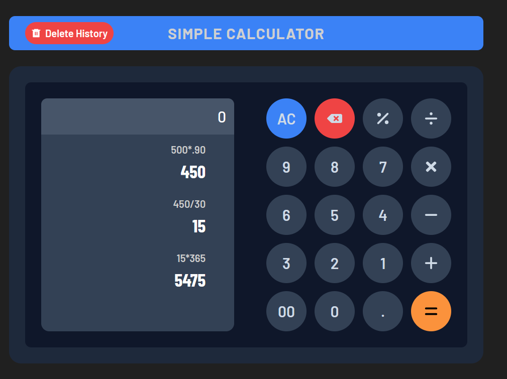

# Simple Calculator

A simple, visually appealing calculator built using modern front-end technologies. This calculator includes basic arithmetic functions and keeps track of calculation history.



## Features

- **Basic Arithmetic Operations**: Addition, subtraction, multiplication, and division.
- **Clear and Backspace Functions**: Easily clear the current entry or correct a mistake.
- **History Tracking**: Display the history of previous calculations.
- **Responsive Design**: Adaptable to various screen sizes.
- **Delete History**: Clear all history with a single button click.

## Live Site

Check out the live version of the app here: [Live Calculator](https://nezuware-internship-task2calculator.vercel.app/)

## Technologies Used

- **HTML5**
- **CSS3**
- **JavaScript**
- **Vite-React**
- **TailwindCSS**
- **daisyUI components(tailwindcss class)** 

## Installation

1. Clone the repository:

   ```bash
   git clone https://github.com/prakashraja-0723/Nezuware_Internship_Task.git
   ```

2. Navigate into the project directory:

   ```bash
   cd task_02-calculator
   ```

3. Install dependencies:

   ```bash
   npm install
   ```

4. Run the application:

   ```bash
   npm run dev
   ```


The app will be available at `http://localhost:5173/`.

## Usage

- Use the numeric buttons to enter numbers.
- Use the `+`, `-`, `*`, and `/` buttons to perform arithmetic operations.
- Press `=` to get the result.
- Press `AC` to clear the screen.
- Press the backspace icon to delete the last entry.
- View your calculation history on the left side.
- Use the **Delete History** button to remove all previous calculations.
- keyboard input support.

## Future Improvements

- Add scientific calculator functions (e.g., square root, percentage).
- Improve accessibility for users with disabilities.
