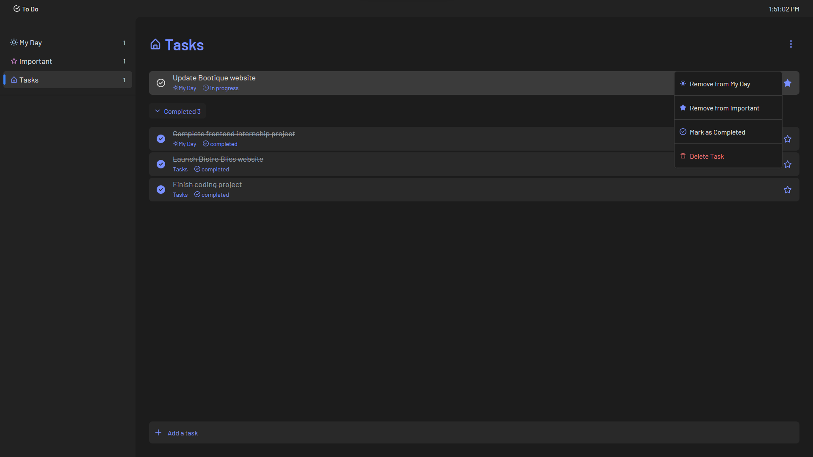

# To-Do Application

A feature-rich to-do application built with Vite and React, leveraging localStorage to save tasks. The app allows users to categorize tasks into two sections: **My Day** and **Important**, and also offers theme options for better user experience.



## Features

- **Task Categories**:
    - **My Day**: Tasks specifically set for the current day.
    - **Important**: Highlight and prioritize important tasks.

- **Task Options**: Each task has the following options:
    - **Add from My Day**: Unmark the task as a "My Day" task.
    - **Mark as Important**: Unmark the task as an "Important" task.
    - **Mark as Completed**: Mark the task as completed.
    - **Delete Task**: Permanently remove the task.

- **Themes**: The application supports multiple themes for a personalized user interface.

- **LocalStorage Support**: All tasks are saved in the browser's localStorage, ensuring that tasks persist across sessions.

- **Vite + React**: This project is powered by Vite for fast development and React for building the UI.

- **Responsive Design**: Works on both desktop and mobile devices.

## Live Site

Check out the live version of the app here: [Live To-Do App](https://nezuware-internship-task.vercel.app/)

## Technologies Used

- **HTML5**
- **CSS3**
- **JavaScript**
- **React**
- **Vite** for fast bundling
- **LocalStorage** for data persistence

## Installation

1. Clone the repository:

   ```bash
   git clone https://github.com/your-username/todo-app.git
   ```

2. Navigate into the project directory:

   ```bash
   cd todo-app
   ```

3. Install dependencies:

   ```bash
   npm install
   ```

4. Run the development server:

   ```bash
   npm run dev
   ```

   The app will be available at `http://localhost:5173/`.

## Usage

- Add a new task by typing in the input field at the bottom and pressing "Enter".
- Categorize tasks under **My Day** or **Important**.
- Use the task options menu to manage each task: mark as completed, remove from categories, or delete.
- Switch between themes for a customized UI.
- Tasks are saved automatically in the browser's localStorage, so you won’t lose them when you close the app.

## Future Improvements

- Add notifications for due tasks.
- Integrate a calendar for better task planning.
- Allow task editing functionality.
- Synchronize tasks across devices using cloud storage.


